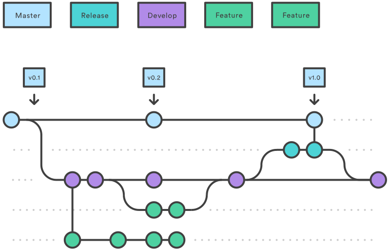

## Release branch :

- 
- Once develop has acquired enough features for a release (or a predetermined release date is approaching), you fork a release branch off of develop. Creating this branch starts the next release cycle, so no new features can be added after this point—only bug fixes, documentation generation, and other release-oriented tasks should go in this branch. Once it's ready to ship, the release branch gets merged into master and tagged with a version number. In addition, it should be merged back into develop
- Using a dedicated branch to prepare releases makes it possible for one team to polish the current release while another team continues working on features for the next release.
- It also creates well-defined phases of development (e.g., it's easy to say, “This week we're preparing for version 4.0,” and to actually see it in the structure of the repository).
- Making release branches is another straightforward branching operation. Like feature branches, release branches are based on the develop branch.
- \$ git checkout develop
- \$ git checkout -b release/0.1.0
- (To finish a release branch, use the following methods)
- Using Gitflow extension:
  - \$ git flow release start 0.1.0 (Switched to a new branch 'release/0.1.0')
  - \$ git flow release finish '0.1.0'
- Without using Gitflow release
  - \$ git checkout master
  - \$ git merge release/0.1.0

## Hot fix branch :

- 
- Maintenance or “hotfix” branches are used to quickly patch production releases. Hotfix branches are a lot like release branches and feature branches except they're based on master instead of develop
- This is the only branch that should fork directly off of master. As soon as the fix is complete, it should be merged into both master and develop (or the current release branch), and master should be tagged with an updated version number.
- Having a dedicated line of development for bug fixes lets your team address issues without interrupting the rest of the workflow or waiting for the next release cycle.
- $ git checkout master
- $ git checkout -b hotfix_branch
- Using gitflow extension
  - $ git flow hotfix start hotfix_branch
- $ git checkout master
- $ git merge hotfix_branch (merging hotfix_branch into master branch)
- $ git checkout develop
- $ git merge hotfix_branch (merging hotfix_branch into develop branch)
- $ git branch -D hotfix_branch (delete hotfix branch)
- Using extension
  - $ git flow hotfix finish hotfix_branch

### Summary using GIT Commands

- Feature Branch WorkFlow
  - git checkout master
  - git checkout -b develop
  - git checkout -b feature_branch
  - (work happens on feature branch)
  - git checkout develop
  - git merge feature_branch
  - git checkout master
  - git merge develop
  - git branch -d feature_branch
- Hot Release branch
  - git checkout master
  - git checkout -b hotfix_branch
  - (work is done commits are added to the hotfix_branch)
  - git checkout develop
  - git merge hotfix_branch
  - git checkout master
  - git merge hotfix_branch

---

- **References**: https://www.atlassian.com/git/tutorials/comparing-workflows/gitflow-workflow
